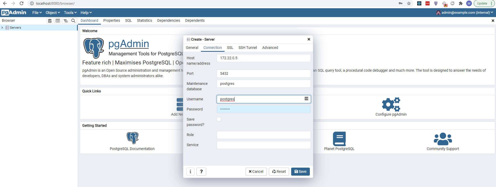
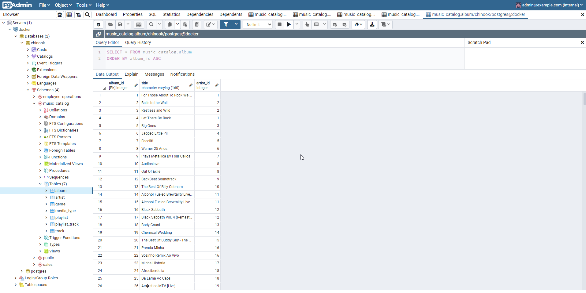

# CleanArchitecture

## Overview

A clean architecture implementation based on this project https://github.com/drminnaar/chinook.

## Getting started

### Requirements
- docker
- docker-compose
- dotnet core 3.1

### Database setup
Postgres is used to store the data releated to the service.
-  when run on Windows docker, the *data/migrations* folder must be shared. 
Go to Settings -> Resources -> File sharing in Docker desktop application and add this folder.
- run script to create the database and populate with data. The script will start postgres container,  drop / create the *chinook* database and apply the database migrations using [Flyway](https://flywaydb.org/)

```
# create database and apply migrations
./refresh-chinook-db.ps1
```

### Run dependencies
- postgres
- pgAdmin

```
docker-compose up
```
### Check the database and the tables
* go to http://localhost:8080/ and log in with the user and password specified in the *docker-compose.yml*
* add the server running in docker using the *user*: postgres and *password*: password

* check that database and the tables were created and populated with data


