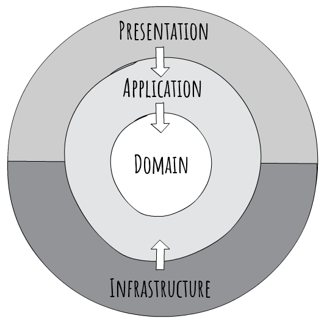

# CleanArchitecture

## Overview

A clean architecture implementation based on different sources like [drminnaar](https://github.com/drminnaar/chinook), [alexcodetuts](https://alexcodetuts.com/2020/02/05/asp-net-core-3-1-clean-architecture-invoice-management-app-part-1/), [eShopOnContainers](https://github.com/dotnet-architecture/eShopOnContainers), [jasontaylor](https://jasontaylor.dev/clean-architecture-getting-started/)

## Getting started

### Requirements
- docker
- docker-compose
- dotnet core 3.1

### Run dependencies
- postgres
- pgAdmin
- prometheus
- grafana
- elasticsearch
- kibana

```
.\start-infra.ps1 -BaseFolder "C:\docker\CleanArchitecture"
```

### Database

Postgres is used to store the data related to the service.

Recently the project is using EFCore migrations instead of Flyway.
The migrations are automatically applied when app starts. That is acceptable for a proof of concept, but if the service will run in multiple instances, this can lead to several migrations happen in parallel.
It is recommended, to have a standalone console app, that will call perform the migration in a CICD pipeline, and then the instances of the app are deployed.
Some sample data is seeded also at startup.

```csharp
await _context.Database.MigrateAsync();
```

To create the migrations, the following command was used:
```
dotnet ef migrations add InitialCreate --project src\Catalog\Catalog.Infrastructure --startup-project src\Catalog\Catalog.Api --output-dir Data\Migrations
```


- ~~ run script refresh-chinook-db.ps1 to create the database and populate with data. The script will start postgres container,  drop / create the *chinook* database and apply the database migrations using [Flyway](https://flywaydb.org/) ~~

### Check the database and the tables
* go to http://localhost:8080/ and log in with the user and password specified in the *docker-compose.yml*
* add the server running in docker using the *user*: postgres and *password*: password

* check that database and the tables were created and populated with data


### Check that grafana and prometheus are running
- go to http://localhost:3000
    - Username: *admin*
    - Password: *grafana*
- go to http://localhost:9090

### Check that elasticsearch and kibana are running
- go to http://localhost:9200
- go to http://localhost:5601


### Run application

```
cd src\Catalog\Catalog.Api
dotnet build
dotnet run
```

## Notes

### Clean architecture

The **Domain** layer contains enterprise logic and types and the **Application** layer contains business logic and types. The difference is that enterprise logic could be shared across many systems, whereas the business logic will typically only be used within this system. **Application** contains the use cases of the system. **Presentation** could be a WebApi, an UI, etc. **Infrastructure** contains implementations of data repositories, access to 3rd party services, etc.

**Domain** and **Application** are also known as the **Core**. **Infrastructure** and **Presentation** depend on **Core**, but not on one another.



### Request validation
- the validation of requests can be done in several ways:
    - with data annotations
    ```cs
        [Required(ErrorMessage = "Price is required")]
        [Range(0, 5, ErrorMessage = "Price should be set at 0-5 dollars")]
        public decimal Price { get; set; }
    ```

    - using MediatR pipeline behaviour as described [here](https://code-maze.com/cqrs-mediatr-fluentvalidation/) and this is the one used in this repo. The validators are defined on Commands  or Query objects in Application layer and an exception is thrown which gets handled in a custom exception handler.

    - using [Fluent Validation with AspNetCore](https://docs.fluentvalidation.net/en/latest/aspnet.html). This approach is more generic since it does not require MediatR. Note that if the WebApi layer is switched with another layer like a Console app, this validation will not work out of the box. So doing validation with Mediatr pipelines might be a better solution.
    Validation is implemented in the Application layer on the models bound by asp net core. When validation fails, a BadRequest response is sent using a ValidationProblemDetails model.
    ```json
    {
        "type": "https://tools.ietf.org/html/rfc7231#section-6.5.1",
        "title": "One or more validation errors occurred.",
        "status": 400,
        "traceId": "|d23b405c-4cc972fec0cf47c2.",
        "errors": {
            "name": [
            "'Name' must be between 0 and 10 characters. You entered 11 characters."
            ],
            "PriceTo": [
            "Value must be in the form of 'gt:10.5', gte:10.5, lt:10.5, lte:10.5, eq:10.5"
            ],
            "PriceFrom": [
            "Value must be in the form of 'gt:10.5', gte:10.5, lt:10.5, lte:10.5, eq:10.5"
            ]
        }
    }
    ```

### Error handling
- [Exception handling](https://docs.microsoft.com/en-us/aspnet/core/fundamentals/error-handling) is done with UseExceptionHandler middleware which is recommended over exception filters

- ProblemDetails and ValidationProblemDetails is used to return more details in HTTP response in case of problems and complies with [RFC 7807](https://tools.ietf.org/html/rfc7807)

### MediatR
- [MediatR](https://github.com/jbogard/MediatR) is used to implement CQRS. A good explenation of the Mediator pattern can be found [here](https://refactoring.guru/design-patterns/mediator). Other good references of using MediatR are [here](https://ardalis.com/moving-from-controllers-and-actions-to-endpoints-with-mediatr/)
- There are advantages and some desadvantages to use this pattern described [here](https://codeopinion.com/why-use-mediatr-3-reasons-why-and-1-reason-not/), but to highlight some of the advantages:
    - Decoupling application code from the top-level framework code (presentation layer)
    - Support for behaviour pipelines which are similar to filters  in AspNet Core WebApi. This allows to address [cross-cutting concerns](https://codewithmukesh.com/blog/mediatr-pipeline-behaviour/) like validation, logging, audit

### Logging
- [Serilog](https://github.com/serilog/serilog-aspnetcore) is used for logging to ELK stack based on [Tutorial1](https://codewithmukesh.com/blog/serilog-in-aspnet-core-3-1/), [Tutorial2](https://www.humankode.com/asp-net-core/logging-with-elasticsearch-kibana-asp-net-core-and-docker). 
To visualize the logs in Kibana (http://localhost:5601), first we have to create an index *catalog-\**


### Client library
- [NSwag](https://github.com/RicoSuter/NSwag) is used to autogenerate the C# client library based on the details explained [here](https://blog.sanderaernouts.com/autogenerate-csharp-api-client-with-nswag). 
A client is generated for each controller from the Api project. 
In order to use the client from any other project, you need to add the [dependency injection in HTTP Client Factory](https://itnext.io/use-http-client-factory-with-nswag-generated-classes-in-asp-net-core-3-c1dd66ee004c) for it and then inject it in the classes where needed.
```cs
services.AddHttpClient<ITracksClient, TracksClient>(client => 
    client.BaseAddress = new Uri("https://localhost:5000"));
```

- no contracts library is created. The models to the outside world are defined in Application project. When the NSwag autogenerated client is created these models are recreated automatically there. The reason we do not offer a contracts library is that it would serve no purpose for a typescript or python client.

### Monitoring
- Monitoring with [AppMetrics](https://github.com/AppMetrics/AppMetrics), Prometheus and Grafana based on the follwing tutorials : [Tutorial1](https://www.youtube.com/watch?v=sM7D8biBf4k) and [Tutorial2](https://alikhalili.me/blog/posts/appmetrics-prometheus-grafana-asp-core/). Prometheus is scrapping the metrics api (http://localhost:5000/metrics-text) and Grafana is used to visualize the metrics

*Note*: seems that the protobuf formatter exposed at the /metrics endpoint does not work. The text formatter is used in the current setup.


### Health Checks
- [Health Checks](https://docs.microsoft.com/en-us/aspnet/core/host-and-deploy/health-checks) were added for the application itself and for the connection to the Postgres Sql Database. Note that the DBContext healthcheck was added in the depenedency injection of the Infrastructure project.
A [Watchdog](https://docs.microsoft.com/en-us/dotnet/architecture/microservices/implement-resilient-applications/monitor-app-health#use-watchdogs) service can be created to display the status of the services monitored


### Testing
- [Integration tests](https://docs.microsoft.com/en-us/aspnet/core/test/integration-tests) are implemented using **WebApplicationFactory** and test the entire stack using an in memory database. 
Some good references can be found [here](https://andrewlock.net/converting-integration-tests-to-net-core-3/) and [here](https://adamstorr.azurewebsites.net/blog/integration-testing-with-aspnetcore-3-1-swapping-dependency-with-moq)
- these kind of tests allow to test also the DI (Startup class) and allows to swap only some dependencies.

### Best practices
- use Swagger embedded in Microsoft packages and not a third party library

- IUrlHelper is used to generate links inside the application

- the APIs allow for filtering which is passed along to the repository

- Pagination is returned using X-Pagination header
```json
{
    "CurrentPageNumber":2,
    "ItemCount":3503,
    "PageSize":10,
    "PageCount":351,
    "FirstPageUrl":"http://localhost:5000/v1/tracks?page=1&limit=10",
    "LastPageUrl":"http://localhost:5000/v1/tracks?page=351&limit=10",
    "NextPageUrl":"http://localhost:5000/v1/tracks?page=3&limit=10",
    "PreviousPageUrl":"http://localhost:5000/v1/tracks?page=1&limit=10",
    "CurrentPageUrl":"http://localhost:5000/v1/tracks?page=2&limit=10"
    }
```

- no versioning is provided for the contract DTO models yet

- we use both DTO models and Command / Queries models, but DTOs can be removed and Command / Queries models used directly in the Controller

- the dependcency injection is done in the project where the actual implementations are done. For example the DI for automapper, mediatr and fluent validators is done in the Application project, the DI for the database connection + db health check and repository is done in Infrastructure, the DI for swagger, logging is done in the API

- both Commands and Queries use the repository, but an alternative would be to use the repository for the Commands (using EF core for example) and use an IPlaylistsQuery (using Dapper which is faster than EFCore) for Queries. This [approach](https://docs.microsoft.com/en-us/dotnet/architecture/microservices/microservice-ddd-cqrs-patterns/cqrs-microservice-reads) is used in EShopOnContainers app in Ordering service. This approach is also helpful if the database for writes and reads is different.


## TODOs
- implement a selector capability
- decide if models remain in Application or moved as versioned in Api
- emit notifications
- add documentation about the repository and unit of work
- investigate if [Scrutor](https://github.com/khellang/Scrutor) can be used to achive something similar to StructureMap scan.Assembly("InfraStructure") [this article]() to remove the project reference from Api to Infrastructure project
- CosmosDb persistence